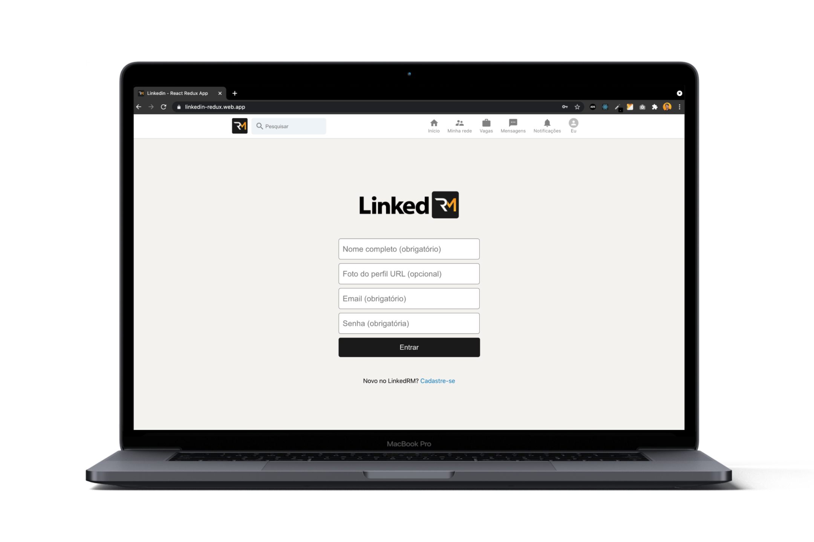
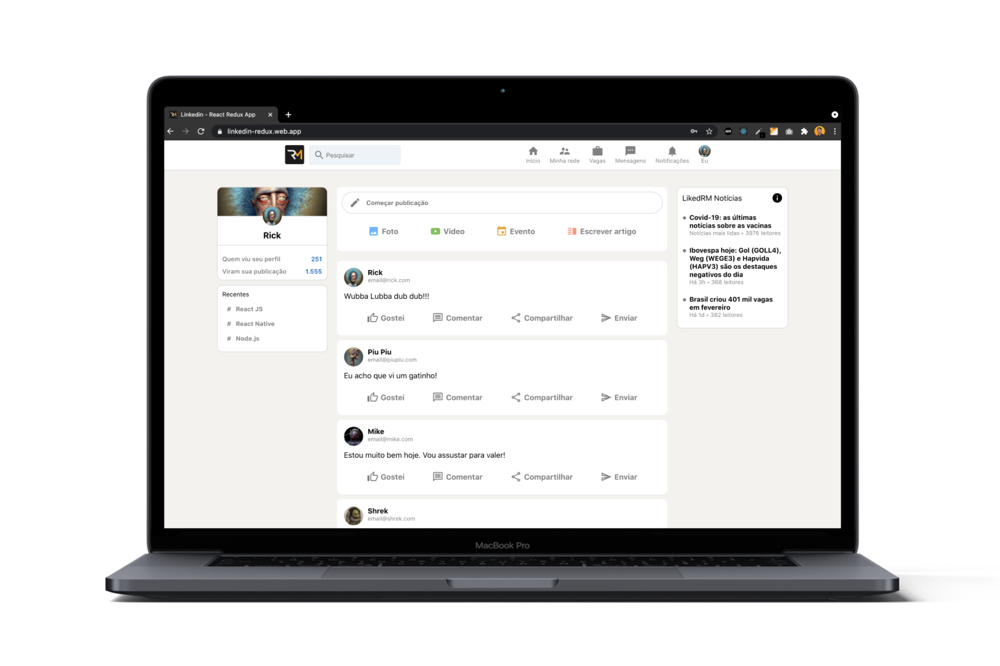

<h1 align="center">
    
    <br>
</h1>

<p align="center">
  <a href="https://www.linkedin.com/in/rafael-martins92/">
  
	</a>
  
  
  
  
  
  
  
  
</p>

<h4 align="center">
  <p>LinkedRM - Learning Redux</p>
  
  <p>This application was developed to learn more about Redux.</p>

  <p>Developed with React JS, CSS, Redux and Firebase.</p>
</h4>


<p align="center">
  <a href="#rocket-technologies">Technologies</a>&nbsp;&nbsp;&nbsp;|&nbsp;&nbsp;&nbsp;
  <a href="#eyes-check-it-out">Check it Out</a>&nbsp;&nbsp;&nbsp;|&nbsp;&nbsp;&nbsp;
  <a href="#information_source-how-to-use">How To Use</a>&nbsp;&nbsp;&nbsp;|&nbsp;&nbsp;&nbsp;
  <a href="#memo-license">License</a>
</p>

<p align="center">
  
  
</p>

## :rocket: Technologies

This project was developed with the following technologies:

-  [JavaScript](https://developer.mozilla.org/pt-BR/docs/Web/JavaScript)
-  [React JS](https://pt-br.reactjs.org/)
-  [CSS](https://developer.mozilla.org/pt-BR/docs/Web/CSS)
-  [Redux](https://redux.js.org/)
-  [Firebase](https://firebase.google.com/?hl=pt-br)
-  [VS Code][vc] with [EditorConfig][vceditconfig] and [ESLint][vceslint]
## :eyes: Check it Out

You can try it here:

-  [LinkedRM][demo]

## :information_source: How to Use

To clone and run this application, you'll need [Git](https://git-scm.com), [Node.js][nodejs] + [Yarn][yarn] installed on your computer.

From your command line:

```bash
# Clone this repository
$ git clone https://github.com/rafaelmartins92/linkedin-redux.git linkedin-redux

# Go into the repository
$ cd linkedin-redux

# Install dependencies
$ npm install

# Run the server
$ npm start

# The web application will open on port:3000 
# To access it go to http://localhost:3000 
```

## :memo: License
This project is under the MIT license. See the [LICENSE](https://github.com/rafaelmartins92/linkedin-redux/blob/master/LICENSE) for more information.

---

<h4 align="center">
    Made with ♥ by Rafael Martins 👋 <a href="https://www.linkedin.com/in/rafael-martins92/" target="_blank">Get in touch!</a>
</h4>

[nodejs]: https://nodejs.org/
[yarn]: https://yarnpkg.com/
[vc]: https://code.visualstudio.com/
[vceditconfig]: https://marketplace.visualstudio.com/items?itemName=EditorConfig.EditorConfig
[vceslint]: https://marketplace.visualstudio.com/items?itemName=dbaeumer.vscode-eslint
[demo]: https://linkedin-redux.web.app/
